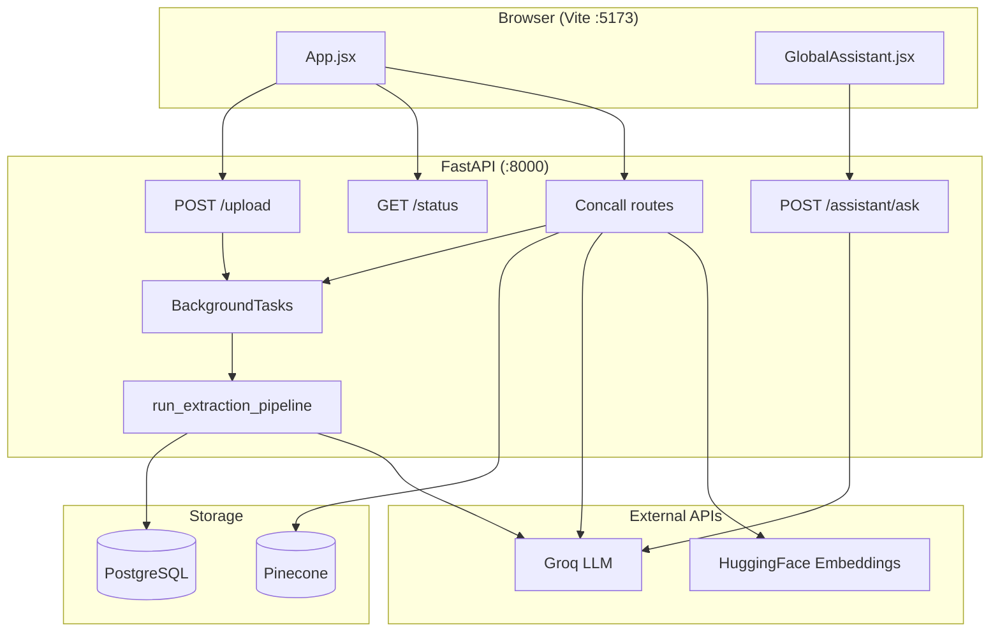
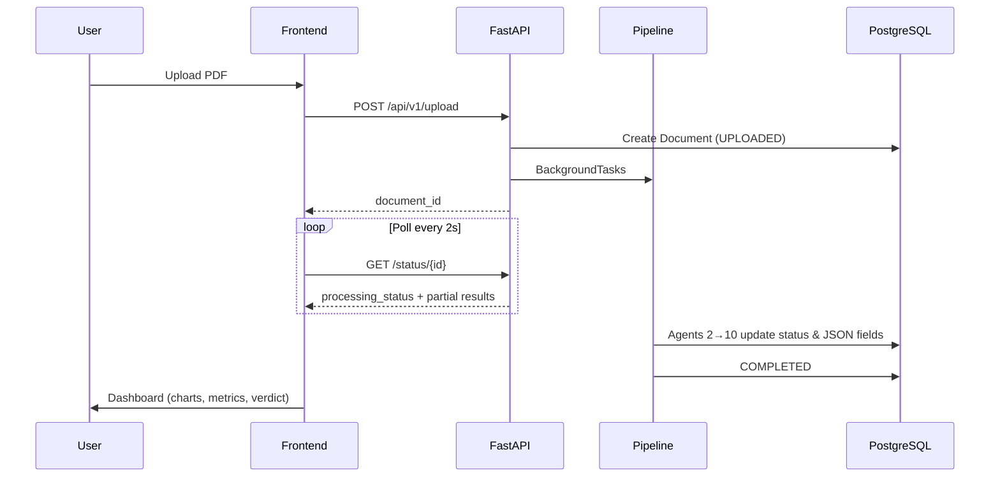

# AI Financial Results Analyzer

<p align="center">
  <strong>Ingest financial PDFs → extract metrics → analyze → summarize → verdict.</strong><br>
  Plus earnings-call RAG chat and a global financial assistant.
</p>

<p align="center">
  
  
  
  
  
  
</p>

---

## Table of contents

- [Overview](#overview)
- [What you can do](#what-you-can-do)
- [Architecture](#architecture)
- [How the PDF pipeline works](#how-the-pdf-pipeline-works)
- [How concall RAG works](#how-concall-rag-works)
- [Tech stack](#tech-stack)
- [Project structure](#project-structure)
- [Data model](#data-model)
- [API reference](#api-reference)
- [Frontend](#frontend)
- [Configuration](#configuration)
- [Getting started](#getting-started)
- [ML model training](#ml-model-training)
- [Deployment](#deployment)
- [Limitations & known gaps](#limitations--known-gaps)
- [Troubleshooting](#troubleshooting)
- [License](#license)

---

## Overview

**AI Financial Results Analyzer** is a full-stack application aimed at retail investors and analysts working with **Indian corporate financial filings** (quarterly/annual results, etc.). You upload a PDF; the system classifies it, extracts structured numbers with an LLM, computes growth and balance-sheet metrics in **deterministic Python** (so displayed figures are not LLM-hallucinated), generates plain-language summaries, and outputs a simple **GOOD / BAD / NEUTRAL** verdict from a trained classifier.

A second flow lets you upload **earnings-call transcripts** and ask questions via **retrieval-augmented generation** (Pinecone + Groq). A third feature is a **floating assistant** for general finance Q&A.

> **Design principle:** LLMs extract structure from messy PDF text; **all math and ratios run in code** (Agent 7) before summaries and charts are built.

---

## What you can do

| Module | Description |
|--------|-------------|
| **Financial results** | Upload a text-native PDF → 10-agent pipeline → dashboard with charts, P&L trends, balance sheet, cash flow, NLP bullets, verdict badge |
| **Earnings call** | Upload PDF/`.txt` → embed into Pinecone → chat grounded in transcript chunks |
| **Global assistant** | Ask financial concepts anytime from the floating chat (no document required) |

---

## Architecture

### High-level system diagram



### PDF pipeline flow



### Processing model

- **Async execution:** `FastAPI.BackgroundTasks` — jobs run in the same process as the API (no Celery/Redis queue in current code).
- **Ephemeral files:** Uploaded PDFs are deleted after the pipeline finishes (`data/uploads/`).
- **Schema bootstrap:** Tables are created on API startup via SQLAlchemy `create_all` (no Alembic migrations in repo).

---

## How the PDF pipeline works

The pipeline is orchestrated in `backend/app/core/pipeline.py`. Each stage updates `documents.processing_status` so the UI can show live progress.

| # | Status enum | Module | Responsibility |
|---|-------------|--------|----------------|
| 1 | `UPLOADED` | `api/routes.py` | Validate PDF (type, encryption), save file, insert DB row, dispatch pipeline |
| 2 | `CLASSIFYING_PDF` | `agent_2_pdf_type.py` | Count text vs empty pages → `text_pdf` / `scanned_pdf` / `hybrid_pdf`. **Rejects scanned/hybrid** |
| 3 | `OCR_EXTRACTION` | `agent_3_ocr.py` | PyMuPDF per-page text → `extracted_text` JSON |
| 4 | `DOCUMENT_CLASSIFICATION` | `agent_4_classifier.py` | TF-IDF + LogReg (`doc_classifier.joblib`) or keyword fallback → `metadata_json.document_category` |
| 5 | `TABLE_EXTRACTION` | `agent_5_table_extraction.py` | Regex page scoring for P&L / BS / CF → Groq **structured** extract → `financial_data` |
| 6 | `NORMALIZING_METRICS` | `agent_6_normalization.py` | Flags normalized; **currency scaling is in Agent 7** |
| 7 | `FINANCIAL_ANALYSIS` | `agent_7_analysis.py` | Scale to **₹ crores**, QoQ/YoY, margins, BS, days, FCF → `analysis_results` |
| 8 | `NLP_SUMMARIZATION` | `agent_8_llm_summary.py` | Groq bullets from **calculated metrics only** → `nlp_summary` |
| 9 | `VERDICT_PREDICTION` | `agent_9_verdict.py` | RandomForest on growth/margin features → `verdict` |
| 10 | `VISUALIZATION_PREP` → `COMPLETED` | `agent_10_visualization.py` | Recharts-ready `metadata_json.charts_data` |

### Agent 5 — Page selection (non-LLM)

Before calling Groq, the system scores every page with weighted regex signals (revenue, PAT, balance sheet, cash flow, etc.) and penalizes auditor/notes pages. Target pages plus neighbors are compiled into one context block — reducing tokens and noise.

### Agent 7 — Metrics computed in code

Examples of fields written to `analysis_results` (all optional depending on extraction quality):

| Category | Fields |
|----------|--------|
| Growth | `qoq_growth`, `yoy_growth`, `pat_qoq`, `pat_yoy`, `eps_qoq`, `eps_yoy` |
| Margins | `net_margin`, `pbt_margin`, `ebitda_margin`, `*_fy` variants |
| P&L (₹ cr) | `total_income_q_cr`, `pat_q_current_cr`, `basic_eps`, … |
| Balance sheet | `total_borrowings_cr`, `net_debt_cr`, `current_ratio`, `cwip_cr`, `trade_receivables_cr`, `inventories_cr` |
| Working capital | `inventory_days`, `debtor_days` |
| Cash flow | `operating_cash_flow_cr`, `capex_cr`, `free_cash_flow_cr`, … |

Currency scaling uses `reported_currency_unit` from the LLM (e.g. Lakhs → ×0.01 to crores), with a text fallback if the unit is missing.

### Verdict model

`GOOD` / `BAD` / `NEUTRAL` from `verdict_classifier.joblib` using `qoq_growth`, `yoy_growth`, `net_margin`, and a composite `earnings_strength` score. Response shape:

```json
{ "verdict": "GOOD", "confidence": 0.87 }
```

---

## How concall RAG works

1. **Upload** — `POST /api/v1/concall/upload-and-process` (multipart: file + optional `company_name`, `quarter`, `fiscal_year`).
2. **Process** (background) — Parse PDF or UTF-8 text in memory → chunk (1000 chars, 150 overlap) → embed with `sentence-transformers/all-MiniLM-L6-v2` → upsert to Pinecone with **namespace = `document_id`**.
3. **Chat** — `POST /api/v1/concall/chat` retrieves top-5 chunks (filtered by `document_id`) → Groq answers strictly from context.

**Requirement:** A Pinecone index must already exist (default name: `financial-reports-index`). The app does not create the index automatically.

---

## Tech stack

| Layer | Technology | Role |
|-------|------------|------|
| **UI** | React 19, Vite 8, Tailwind CSS 3 | SPA, brutalist-styled dashboard |
| **Charts** | Recharts 3 | Income/PAT trends, margins, growth bars |
| **HTTP** | Axios | Upload, polling, chat |
| **API** | FastAPI, Uvicorn | REST + OpenAPI at `/docs` |
| **ORM** | SQLAlchemy | PostgreSQL models |
| **PDF** | PyMuPDF (`fitz`) | Text extraction, validation |
| **LLM** | Groq `llama-3.3-70b-versatile` | Structured extraction, summaries, chat |
| **Orchestration** | LangChain | Prompts, structured output, Pinecone integration |
| **Vectors** | Pinecone + HuggingFace embeddings | Concall RAG |
| **ML** | scikit-learn, joblib | Document type + verdict classifiers |
| **Infra (local)** | Docker Compose | PostgreSQL 15 (+ Redis 7 unused by app) |

---

## Project structure

```
AI-Financial-Results-Analyzer/
├── README.md
├── docker-compose.yml          # Postgres + Redis (Redis not used by app)
├── .env                        # You create this (gitignored)
│
├── backend/
│   ├── requirements.txt
│   ├── app/
│   │   ├── main.py             # FastAPI entry, CORS, routers
│   │   ├── api/
│   │   │   ├── routes.py       # Agent 1: upload + status
│   │   │   ├── concall.py      # Concall upload, status, chat
│   │   │   └── assistant.py    # Global assistant
│   │   ├── agents/             # agent_2 … agent_10
│   │   ├── core/
│   │   │   ├── config.py       # Settings / env
│   │   │   ├── db.py           # Engine + get_db
│   │   │   └── pipeline.py     # Sequential agent runner
│   │   ├── models/             # Document, ConcallDocument
│   │   ├── schemas/
│   │   │   └── financial.py    # FinancialRawSchema (LLM output)
│   │   ├── services/
│   │   │   └── concall_processor.py
│   │   └── ml_models/          # *.joblib (gitignored — train locally)
│   └── training/
│       ├── train_doc_classifier.py
│       └── train_verdict_model.py
│
├── frontend/
│   ├── package.json
│   └── src/
│       ├── App.jsx             # Results + Concall tabs (~main UI)
│       ├── index.css           # Tailwind + design tokens
│       └── components/
│           └── GlobalAssistant.jsx
│
└── data/uploads/               # Temporary PDFs (gitignored)
```

---

## Data model

### `documents` (financial PDF pipeline)

| Column | Type | Description |
|--------|------|-------------|
| `id` | UUID string | Primary key |
| `filename` | string | Original file name |
| `file_size` | int | Bytes |
| `upload_timestamp` | datetime | Auto |
| `processing_status` | enum | See pipeline table above |
| `metadata_json` | JSON | Pages, `pdf_type`, `document_category`, `charts_data` |
| `extracted_text` | JSON | `{ "0": "page text", ... }` |
| `financial_data` | JSON | Structured extraction + scaled numbers |
| `analysis_results` | JSON | Computed metrics (Agent 7) |
| `nlp_summary` | JSON | Executive summary, highlights, risks, etc. |
| `verdict` | JSON | `{ verdict, confidence }` |
| `error_message` | string | Set when `FAILED` |

### `concall_documents`

| Column | Description |
|--------|-------------|
| `id` | UUID |
| `company_name`, `quarter`, `fiscal_year` | Metadata |
| `processed_status` | `PENDING` \| `COMPLETED` \| `FAILED` |
| `error_message` | On failure |

### Extraction schema (`FinancialRawSchema`)

Pydantic model used by Agent 5 (Groq structured output), including:

- **Metadata:** `reported_currency_unit`, `source_page_indices`, `extraction_confidence`
- **P&L:** Five period columns (current Q, prev Q, Q year-ago, FY current, FY prev)
- **Balance sheet:** Current + previous period fields (borrowings, cash, receivables, inventories, …)
- **Cash flow:** Operating / investing / financing lines for current + previous

See `backend/app/schemas/financial.py` for the full field list.

---

## API reference

Base URL (local): `http://localhost:8000`

Interactive docs: **[http://localhost:8000/docs](http://localhost:8000/docs)**

### Endpoints

| Method | Path | Description |
|--------|------|-------------|
| `GET` | `/` | Health message |
| `POST` | `/api/v1/upload` | Upload financial PDF (`multipart/form-data`, field `file`) |
| `GET` | `/api/v1/status/{document_id}` | Poll status and results |
| `POST` | `/api/v1/concall/upload-and-process` | Upload transcript |
| `GET` | `/api/v1/concall/status/{document_id}` | Concall job status |
| `POST` | `/api/v1/concall/chat` | RAG Q&A |
| `POST` | `/api/v1/assistant/ask` | Global assistant |

### Examples

<details>
<summary><strong>Upload financial PDF</strong></summary>

```bash
curl -X POST "http://localhost:8000/api/v1/upload" \
  -H "accept: application/json" \
  -H "Content-Type: multipart/form-data" \
  -F "file=@./sample-results.pdf"
```

Response:

```json
{
  "document_id": "a1b2c3d4-...",
  "filename": "sample-results.pdf",
  "file_size": 245678,
  "total_pages": 12,
  "status": "UPLOADED"
}
```

</details>

<details>
<summary><strong>Poll document status</strong></summary>

```bash
curl "http://localhost:8000/api/v1/status/{document_id}"
```

Response (when complete):

```json
{
  "status": "COMPLETED",
  "metadata": { "total_pages": 12, "pdf_type": "text_pdf", "charts_data": { ... } },
  "analysis_results": { "qoq_growth": 5.2, "yoy_growth": 12.1, "net_margin": 8.4, ... },
  "nlp_summary": {
    "executive_summary": ["...", "..."],
    "investor_explanation": ["..."],
    "highlights": ["..."],
    "risks": ["..."]
  },
  "verdict": { "verdict": "GOOD", "confidence": 0.82 },
  "financial_data": { ... },
  "error_message": null
}
```

</details>

<details>
<summary><strong>Upload earnings call</strong></summary>

```bash
curl -X POST "http://localhost:8000/api/v1/concall/upload-and-process" \
  -F "file=@./earnings-call.txt" \
  -F "company_name=Example Ltd" \
  -F "quarter=Q3" \
  -F "fiscal_year=FY26"
```

</details>

<details>
<summary><strong>Concall chat</strong></summary>

```bash
curl -X POST "http://localhost:8000/api/v1/concall/chat" \
  -H "Content-Type: application/json" \
  -d '{
    "document_id": "your-concall-uuid",
    "query": "What did management say about margins?"
  }'
```

</details>

<details>
<summary><strong>Global assistant</strong></summary>

```bash
curl -X POST "http://localhost:8000/api/v1/assistant/ask" \
  -H "Content-Type: application/json" \
  -d '{
    "query": "What is P/E ratio?",
    "history": []
  }'
```

</details>

---

## Frontend

| Area | Details |
|------|---------|
| **Tabs** | `RESULTS` (PDF pipeline) and `CONCALL` (transcript RAG) |
| **Polling** | Status every **2 seconds** until `COMPLETED` or `FAILED` |
| **Progress UI** | Animated loader during `TABLE_EXTRACTION` and concall `PENDING` |
| **Charts** | Recharts line/bar charts from `metadata.charts_data` |
| **Verdict** | Color-coded GOOD / BAD / NEUTRAL badge |
| **Assistant** | Fixed bottom-right widget (`GlobalAssistant.jsx`) |

**API base URL** (same host as browser, port 8000):

```javascript
const API_BASE = `http://${window.location.hostname}:8000/api/v1`;
```

Defined in `frontend/src/App.jsx` and `frontend/src/components/GlobalAssistant.jsx`. For production, point this to your deployed API (or use `VITE_API_BASE` with a `.env.production` file).

---

## Configuration

Create **`.env`** in the repository root (loaded by `backend/app/main.py`):

| Variable | Required | Default | Description |
|----------|----------|---------|-------------|
| `POSTGRES_USER` | No | `postgres` | DB user |
| `POSTGRES_PASSWORD` | No | `password` | DB password |
| `POSTGRES_SERVER` | No | `localhost` | DB host |
| `POSTGRES_DB` | No | `financial_analyzer` | Database name |
| `GROQ_API_KEY` | **Yes** (PDF + chat) | — | [Groq console](https://console.groq.com/) |
| `PINECONE_API_KEY` | **Yes** (concall only) | — | [Pinecone](https://www.pinecone.io/) |
| `PINECONE_INDEX_NAME` | No | `financial-reports-index` | Existing index name |

Example:

```env
POSTGRES_USER=postgres
POSTGRES_PASSWORD=password
POSTGRES_SERVER=localhost
POSTGRES_DB=financial_analyzer

GROQ_API_KEY=gsk_xxxxxxxx
PINECONE_API_KEY=pcsk_xxxxxxxx
PINECONE_INDEX_NAME=financial-reports-index
```

---

## Getting started

### Prerequisites

- Python **3.10+**
- Node.js **18+**
- Docker (for local PostgreSQL)
- Groq API key
- Pinecone API key + index (only if using concall)

### 1. Clone and configure

```bash
git clone https://github.com/<your-org>/AI-Financial-Results-Analyzer.git
cd AI-Financial-Results-Analyzer
# Create .env from the Configuration section above
```

### 2. Start PostgreSQL

```bash
docker-compose up -d
```

### 3. Backend

```bash
cd backend
python -m venv .venv

# Activate venv
# Windows:  .venv\Scripts\activate
# macOS/Linux:  source .venv/bin/activate

pip install -r requirements.txt

# Train ML models (required for Agents 4 & 9)
python training/train_doc_classifier.py
python training/train_verdict_model.py

# Run API (must be run from backend/)
uvicorn app.main:app --reload
```

### 4. Frontend

```bash
cd frontend
npm install
npm run dev
```

Open **http://localhost:5173** and ensure the API is running on **http://localhost:8000**.

### Quick verification

| Check | URL / action |
|-------|----------------|
| API health | http://localhost:8000/ |
| OpenAPI | http://localhost:8000/docs |
| Upload a text PDF | Results tab in UI |

---

## ML model training

Models are stored in `backend/app/ml_models/` and are **gitignored**. Fresh clones must train before the PDF pipeline completes.

| Script | Output | Model |
|--------|--------|--------|
| `training/train_doc_classifier.py` | `doc_classifier.joblib` | TF-IDF + LogisticRegression (synthetic labels) |
| `training/train_verdict_model.py` | `verdict_classifier.joblib` | RandomForest on growth/margin features |

```bash
cd backend
python training/train_doc_classifier.py
python training/train_verdict_model.py
```

Restart Uvicorn after retraining. For production, replace synthetic training data with real labeled filings.

**Document classifier labels (training):** Quarterly Results, Annual Results, Dividend Notice, Board Meeting Outcome, Investor Presentation, Other.

**Verdict labels:** GOOD, BAD, NEUTRAL.

---

## Deployment

Suggested production layout:

| Component | Suggestion |
|-----------|------------|
| Database | Managed PostgreSQL (Render, Supabase, RDS, …) |
| API | Container or PaaS web service: `uvicorn app.main:app --host 0.0.0.0 --port $PORT` from `backend/` |
| Frontend | Static host (Vercel, Netlify, Cloudflare Pages): `npm run build` → serve `dist/` |
| Secrets | `GROQ_API_KEY`, `PINECONE_*`, Postgres credentials |
| ML artifacts | Run training on deploy or commit models to secure storage (not public git) |

**Checklist**

- [ ] Set all environment variables on the API service  
- [ ] Ship or train `ml_models/*.joblib` on the server  
- [ ] Create Pinecone index before enabling concall  
- [ ] Update frontend `API_BASE` to production API URL  
- [ ] Add authentication / rate limiting before public exposure  
- [ ] Consider a real task queue if PDF volume is high (BackgroundTasks blocks the API worker)

---

## Limitations & known gaps

| Topic | Detail |
|-------|--------|
| **PDF type** | Only **text-native** PDFs; scanned/hybrid rejected at Agent 2 |
| **OCR** | No full OCR pipeline; sparse pages may get placeholder text |
| **Auth** | None; CORS allows all origins |
| **Queue** | `BackgroundTasks` in-process — not Celery/Redis |
| **Migrations** | `create_all` only — no Alembic migrations in repo |
| **ML data** | Classifiers trained on **synthetic** samples |
| **Concall metadata** | Frontend form fields exist; upload may send defaults — verify `App.jsx` if you rely on company/quarter labels |
| **Tests / CI** | No automated test suite in repository |

---

## Troubleshooting

| Problem | Likely cause | Fix |
|---------|--------------|-----|
| Pipeline fails at Agent 4 or 9 | Missing `.joblib` files | Run training scripts in `backend/training/` |
| `GROQ_API_KEY not configured` | Missing env var | Add to root `.env`, restart API |
| Concall upload fails | Pinecone key/index | Create index; set `PINECONE_*` vars |
| `Scanned copy detected` | Image-only PDF | Use a text-based filing PDF |
| Frontend cannot reach API | CORS / wrong host | API on `:8000`; check firewall; same LAN hostname |
| DB connection error | Postgres not running | `docker-compose up -d`; match `.env` to compose |
| Empty charts / metrics | Poor extraction | Try a cleaner PDF; check Agent 5 logs |

---

## License

Specify your license here (e.g. MIT, Apache-2.0). If this repository has no `LICENSE` file yet, add one before public distribution.

---

<p align="center">
  Built for clearer financial filings — LLM for structure, Python for the numbers.
</p>
